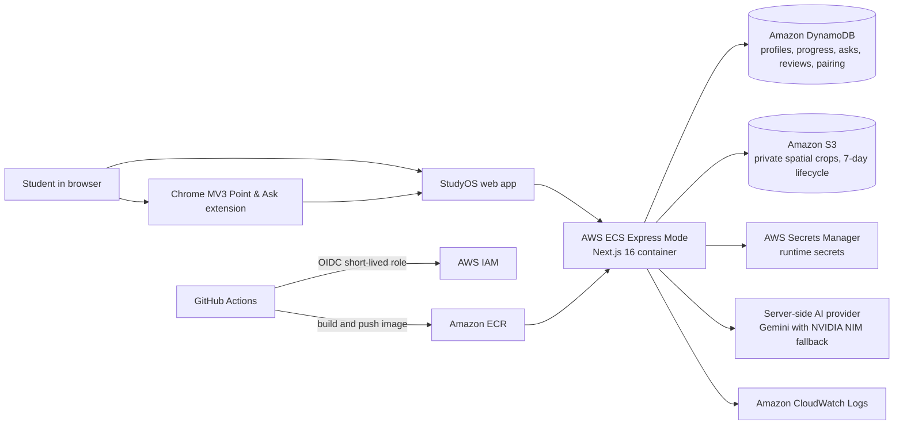
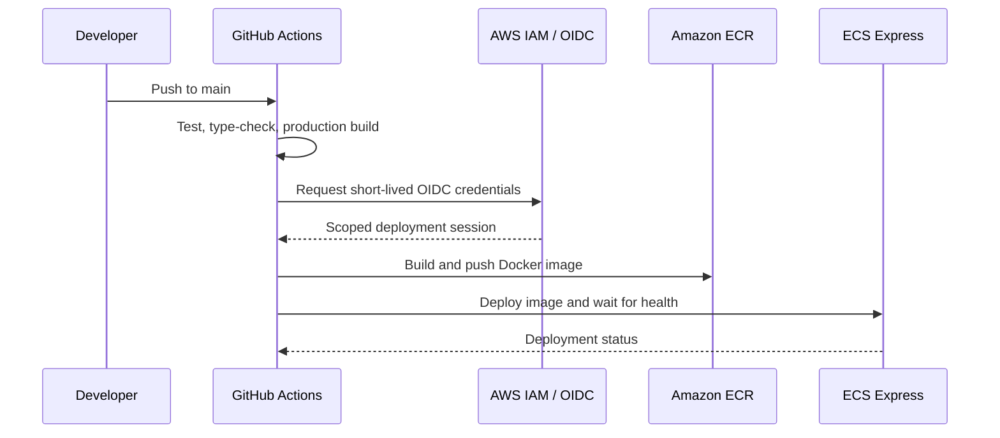

# StudyOS — AWS First Commit Hackathon

> Know what to learn today. Understand what stops you. Remember what matters.

[Open the live demo](https://le-eee1a14046a44cd1b2f9d6fe82789fda.ecs.us-east-1.on.aws/) · [Chrome Point & Ask extension](extension/) · [Demo video](#three-minute-demo-storyboard)

StudyOS is a learning workflow for engineering students. It gives each learner one prerequisite-aware next action, lets them ask about the exact code or text that confused them, and turns useful answers into spaced reviews.

## The problem

Students lose momentum when three things happen at once:

1. They do not know what to learn next.
2. They encounter confusing code or documentation away from their learning dashboard.
3. Helpful explanations disappear instead of becoming material they can revisit.

StudyOS connects those moments into one workflow: **Today → Point & Ask → Save to Review**.

## What is built

| Capability | What the student sees |
|---|---|
| **Today** | A prerequisite-aware next topic from the DSA Foundations curriculum, with progress and review priority. |
| **Point & Ask** | Select code or text in Chrome, ask a question, receive a context-grounded explanation, and provide feedback. |
| **Spatial Point & Ask** | Press `Alt + Shift + A` or use the extension button, box a visual region, and ask about the resolved DOM object and nearby context. |
| **Spaced review** | Save a helpful answer to Review, then use Again or Good to schedule the next repetition. |
| **Organizations** | Master Admin, Organization Admin, and Student roles with scoped content, invites, and cohort progress. |
| **Safety controls** | Per-user quotas, idempotency keys, durable request state, bounded context, and server-side AI credentials. |

## Live demo

1. Open the [public demo](https://le-eee1a14046a44cd1b2f9d6fe82789fda.ecs.us-east-1.on.aws/).
2. Choose **Open Student Demo** → **Open Student Dashboard**. No Google account or onboarding is required.
3. Use **Settings** to generate a one-time extension pairing code.
4. In the extension, choose **Pair extension with StudyOS**, enter the code, then connect.
5. Select text for Point & Ask, or use **Circle & Ask** / `Alt + Shift + A` to box an area for Spatial Point & Ask.
6. Mark a useful answer Helpful and save it to Review.

> The extension sends the selected text, the resolved target, nearby context, basic page metadata, and the student’s question only after the student invokes Ask. It does not send a full webpage or full screenshot by default.

## Architecture



### Request path

```text
Browser or Chrome extension
        ↓ HTTPS
ECS Express service running Next.js route handlers
        ├── DynamoDB: durable product state
        ├── S3: optional private Point & Ask crops
        ├── Secrets Manager: injected runtime configuration
        ├── Gemini / NVIDIA NIM: server-side answer generation
        └── CloudWatch: logs and operational visibility
```

There is no API Gateway or Lambda proxy in the live request path. Both the dashboard and the Chrome extension call the same Next.js `/api/*` route handlers.

## How AWS is used

| AWS service | How StudyOS uses it |
|---|---|
| **Amazon ECS Express Mode** | Runs the containerized Next.js 16 application, performs service health checks on `/api/health`, and exposes the public application URL. |
| **Amazon ECR** | Stores the immutable Docker image built from every `main` branch deployment. |
| **Amazon DynamoDB** | Stores users, learning progress, questions, reviews, events, extension tokens, pairing codes, Ask safety state, and organization data. Tables use on-demand billing; safety and organization records use TTL where appropriate. |
| **AWS Secrets Manager** | Holds runtime secrets such as Auth.js configuration and the server-only AI provider key. The extension never receives these values. |
| **AWS IAM + GitHub OIDC** | GitHub Actions assumes a tightly scoped, short-lived deploy role to push to ECR and update ECS. ECS uses separate execution, application, and infrastructure roles. |
| **Amazon S3** | Supports private Point & Ask region crops with public access blocked and a seven-day lifecycle rule. |
| **Amazon CloudWatch Logs** | Supports operational troubleshooting and deployment visibility. |
| **Amazon Bedrock and Cognito** | Provisioned in the infrastructure template for AWS-native evolution; live answer generation is intentionally provider-routed through Gemini with NVIDIA NIM fallback until Bedrock access is verified for the account. |

## Delivery pipeline



The workflow validates the project before deployment, so a failed test, type check, or production build does not reach ECS.

## Security and privacy

- The public hackathon demo offers separate Student and Master Admin demo entry points; it is demonstration data, not a private production tenant.
- Master Admin authorization uses an exact configured email allowlist—never a domain-based guess.
- Extension pairing uses a short-lived, single-use code and an expiring extension token.
- AI keys, Auth.js secrets, and AWS credentials remain server-side. Do not put secrets in the extension, Git, screenshots, or the demo video.
- Ask endpoints use idempotency keys, per-user daily limits, and durable request-safety records to prevent accidental duplicate AI work.

## Three-minute demo storyboard

| Time | Show | Key message |
|---|---|---|
| 0:00–0:20 | Landing page → Student Dashboard | StudyOS tells a student what to learn next. |
| 0:20–0:50 | Today and a topic | The curriculum respects prerequisites and prioritizes due reviews. |
| 0:50–1:25 | Point & Ask on selected code/text | The learner asks about the exact confusing context. |
| 1:25–1:50 | Spatial Point & Ask | A boxed region resolves to a DOM target; no full page is sent by default. |
| 1:50–2:10 | Helpful → Save to Review | Questions become repeatable learning evidence. |
| 2:10–2:45 | ECS, ECR, GitHub Actions, DynamoDB | AWS hosts the app, stores durable state, and deploys through OIDC. |
| 2:45–3:00 | Working student dashboard | StudyOS closes the loop between confusion and learning progress. |

Do not record API keys, secret values, pairing codes, or the AWS Secrets Manager value view.

## Local development

### Prerequisites

- Node.js 22+
- pnpm 12
- Docker for DynamoDB Local
- A server-side Gemini or NVIDIA NIM API key to generate live answers locally

```powershell
git clone https://github.com/Arrnnnaav/StudyOS-Hackathon.git
cd StudyOS-Hackathon
corepack enable
pnpm install

Copy-Item .env.example .env.local

docker run -d --name dynamodb-local -p 8001:8000 amazon/dynamodb-local:latest -jar DynamoDBLocal.jar -sharedDb
$env:DYNAMODB_ENDPOINT = 'http://localhost:8001'
node scripts/create-tables.mjs

pnpm dev
```

Open `http://localhost:3000`. For local extension development, open `chrome://extensions`, enable Developer mode, choose **Load unpacked**, and select the [`extension/`](extension/) folder.

## Configuration notes

The live ECS task receives non-sensitive runtime settings as environment variables and sensitive values from AWS Secrets Manager. The AI provider must be configured server-side before Ask can generate an answer:

```text
NVIDIA_NIM_API_KEY=<server-only NVIDIA NIM key>
# or
GEMINI_API_KEY=<server-only Gemini key>
```

Never add either value to `extension/`, browser local storage, the README, or a Git commit.

## Quality checks

```powershell
pnpm test
pnpm exec tsc --noEmit
pnpm build
```

## Project layout

```text
src/app/                 Next.js pages and route handlers
src/app/dashboard/       Student learning experience
src/app/api/             Product API surface
src/lib/                 DynamoDB, AI, auth, S3, pairing, and safety logic
src/shared/              Testable learning, security, and resolver logic
extension/               Chrome MV3 Point & Ask extension
infra/template.yaml      CloudFormation/SAM AWS resources and IAM roles
.github/workflows/       OIDC-backed test, build, ECR, and ECS delivery pipeline
```

## License

MIT
